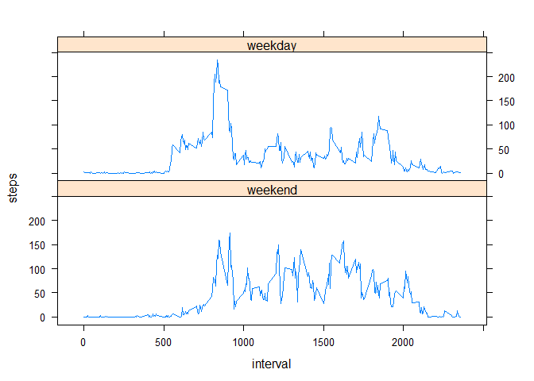

# Reproducible Research: Peer Assessment 1


## Load and preprocessing the data


```r
activity <- data.frame(read.csv("activity.csv"))
summary(activity)
```

```
##      steps                date          interval     
##  Min.   :  0.00   2012-10-01:  288   Min.   :   0.0  
##  1st Qu.:  0.00   2012-10-02:  288   1st Qu.: 588.8  
##  Median :  0.00   2012-10-03:  288   Median :1177.5  
##  Mean   : 37.38   2012-10-04:  288   Mean   :1177.5  
##  3rd Qu.: 12.00   2012-10-05:  288   3rd Qu.:1766.2  
##  Max.   :806.00   2012-10-06:  288   Max.   :2355.0  
##  NA's   :2304     (Other)   :15840
```

## What is mean total number of steps taken per day?

#### 1. Calculate the total number of steps taken per day


```r
daily.steps <- aggregate(x=activity$steps, by = list(activity$date), FUN = sum )
names(daily.steps) <- c("date", "steps")
```

#### 2. Make a histogram of the total number of steps taken each day

```r
hist(daily.steps$steps, breaks = 10, main = "Number of steps per day", xlab = "steps", ylab = "days")
```

<!-- -->

#### 3. Calculate and report the mean and median of the total numbef of steps taken per day

```r
mean.steps = mean(daily.steps$steps, na.rm= TRUE)
median.steps = median(daily.steps$steps, na.rm= TRUE)
central.stats <- c(mean.steps, median.steps)
names(central.stats) <- c("mean.steps", "median.steps")
central.stats
```

```
##   mean.steps median.steps 
##     10766.19     10765.00
```


## Waht is the average daily activity pattern?

#### 1. Make a time series plot of teh 5-minute interval and the average number of steps taken, averaged across all days

```r
interval.steps <- aggregate(x=activity$steps, by = list(activity$interval), FUN = mean, na.rm = TRUE )
names(interval.steps) <- c("5-minute interval", "average steps")
plot(interval.steps, type = "l", main = "average number of steps taken by 5-minute interval")       
```

<!-- -->

#### 2. Which 5-minute interval, on average across all teh days, contains the maximum number of steps?

```r
max.steps <- which.max(interval.steps$`average steps`)
max.interval <- interval.steps[max.steps,]
max.interval
```

```
##     5-minute interval average steps
## 104               835      206.1698
```


## Imputing missing values
#### 1. Calculate and report the total number of missign values in the dataset

```r
missing.count <- sum(is.na(activity$steps))
missing.count
```

```
## [1] 2304
```

#### 2. Strategy for filling in all of hte missign values: replace NA's with the mean for that 5-minute interval

#### 3. Create a new dataset that is equal to the original dataset but wtih the missgni data filled in

```r
activity2 <- activity
activity2$steps[is.na(activity$steps)] <- interval.steps[match(activity$interval, interval.steps$`5-minute interval`),2]
```

```
## Warning in activity2$steps[is.na(activity$steps)] <-
## interval.steps[match(activity$interval, : number of items to replace is not
## a multiple of replacement length
```

#### 4. Make a historgram of the total number of steps taken each day, calculate and report the mean and median for the new data set. 

```r
daily.steps2 <- aggregate(x=activity2$steps, by = list(activity2$date), FUN = sum )
names(daily.steps2) <- c("date", "steps")
hist(daily.steps2$steps, breaks = 10, main = "Number of steps per day", xlab = "steps", ylab = "days")
```

<!-- -->

```r
mean.steps2 = mean(daily.steps2$steps, na.rm= TRUE)
median.steps2 = median(daily.steps2$steps, na.rm= TRUE)
central.stats2 <- c(mean.steps2, median.steps2)
names(central.stats2) <- c("mean.steps2", "median.steps2")
central.stats2
```

```
##   mean.steps2 median.steps2 
##      10766.19      10766.19
```

```r
central.stats
```

```
##   mean.steps median.steps 
##     10766.19     10765.00
```

The mean and median are not much different from the original dataset. Since we used mean value for the 5-minute interval to impute the missing values, the resulting mean is exactly the same as before, and the imputing brought the median closer to the mean in the new dataset.


## Are there differences in activity patterns between weekdays and weekends?

#### 1. Create a new factor variable with two levels, "weekday" and "weekend""

```r
weekdays1 <- c('Monday', 'Tuesday', 'Wednesday', 'Thursday', 'Friday')
activity$wDay <- factor((weekdays(as.Date(activity$date)) %in% weekdays1), levels=c(FALSE, TRUE), labels=c('weekend', 'weekday'))
```

#### 2. Weekday vs Weekend time series plot

```r
interval.steps3 <- aggregate(activity$steps ~activity$interval + activity$wDay, FUN = mean, na.rm = TRUE )
names(interval.steps3) <- c("interval", "wDay", "steps")
library(lattice)
xyplot(steps ~ interval | wDay, data = interval.steps3, type = "l", layout = c(1,2))
```

<!-- -->

